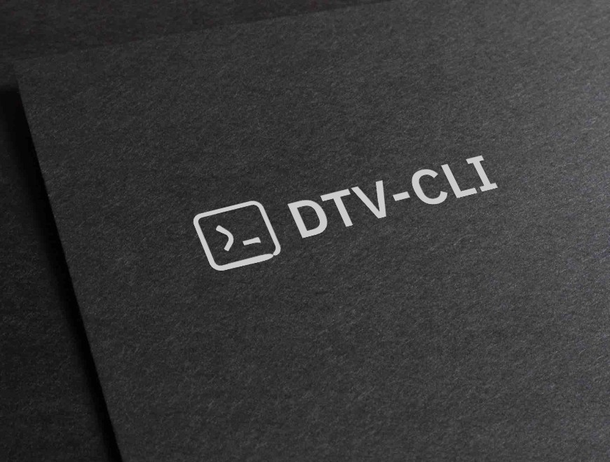

<!-- MANPAGE: BEGIN EXCLUDED SECTION -->
<div align="center">



[](https://github.com/31normaslavik/dtv-cli/releases "Release")
[](https://github.com/yt-dlp/yt-dlp/blob/master/supportedsites.md "Supported Sites")
[](LICENSE "License")
[](https://github.com/31normaslavik/dtv-cli/actions "CI Status")


</div>
<!-- MANPAGE: END EXCLUDED SECTION -->

## RELEASE
 * #### [LINUX](https://github.com/31normaslavik/dtv-cli/releases/latest/download/dtv-cli)


INSTALL
===================================================================

### DEPENDENCIES TO RUN
*  [vot-cli](https://github.com/FOSWLY/vot-cli)
*  [yt-dlp](https://github.com/yt-dlp/yt-dlp)
*  [FFmpeg](https://github.com/FFmpeg/FFmpeg)

## Install from source

### DEPENDENCIES TO BUILD
* [Boost](https://www.boost.org/)
* #### Optionaly
  * [fmt](https://fmt.dev) The compiler version is lower than GNU 13.1 or Clang 17.0.1 or MSVC 19.29 or AppleClang 15.0

## Install binary dependencies

### Arch Manjaro
```
sudo pacman -Syu && \
sudo pacman -S git cmake less boost fmt
```

### Debian
```
sudo apt update && sudo apt upgrade -y && \
sudo apt install git cmake g++ libfmt-dev libboost-program-options1.81-dev libboost-json1.81-dev libboost-url1.81-dev
```
### Ubuntu 24.04
```
sudo apt update && sudo apt upgrade -y && \
sudo apt install git cmake g++ libboost-program-options1.83-dev libboost-json1.83-dev libboost-url1.83-dev

```
### Fedora
```
sudo dnf upgrade --refresh && \
sudo dnf install kernel-devel cmake g++ boost-url boost-devel
```
### Pop Os
```
sudo apt update && sudo apt upgrade -y &&
sudo apt install git cmake g++ libfmt-dev -y
```
### Mageia
```
sudo urpmi.update -a && \
sudo urpmi cmake gcc git lib64fmt-devel lib64boost-devel
```
### BookwormPup64
```
sudo apt update && sudo apt upgrade -y && \
sudo apt install git cmake g++ libfmt-dev libboost-program-options1.81-dev libboost-json1.81-dev libboost-url1.81-dev
```
### ZorinOs
```
sudo apt update && sudo apt upgrade && \
sudo apt install git cmake g++ libfmt-dev
```
### Solus
```
sudo eopkg update-repo && \
sudo eopkg install linux-current-headers git cmake make gcc g++ fmt-devel libboost-devel system.devel
```

## BUILD WITH CMAKE AND INSTALL
```
git clone https://github.com/31normaslavik/dtv-cli.git && \
cd dtv-cli && \
cmake -S . -B _build -D CMAKE_BUILD_TYPE=Release && \
sudo cmake --build _build --config Release --target dtv-cli --target install -j4
```

### You can always download the latest binary version of the dtv-cli on the releases page [Release](https://github.com/31normaslavik/dtv-cli/releases)

### FOR DEVELOP ON VC-CODE
* #### Install bear on your OS
  ```
  sudo pacman -S bear
  sudo apt install bear
  ```
* #### At the root of the project, enter the command

  ```
   rm -rf _build && bear -- cmake -S . -B _build && bear -- cmake --build _build -j4
  ```
  #### Next, if the vc code was running at that moment, restart it, or click Help -> Show all commands -> enter "Reload Window" in the terminal and press Enter. The project is ready for development.